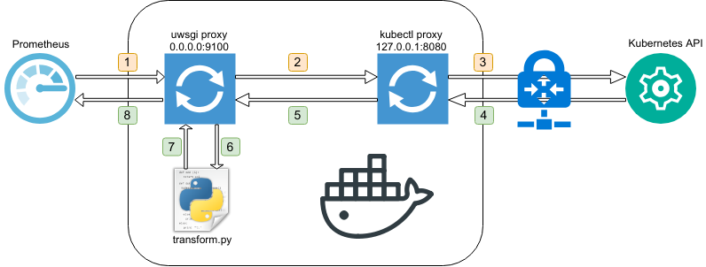

# Kubernetes Metrics Server Prometheus Adapter


## Overview

### What

A Docker image on which [Prometheus](https://github.com/prometheus/prometheus) can scrape Kubernetes metrics provided by **[metrics-server](https://github.com/kubernetes-incubator/metrics-server)**. The image can run anywhere where Prometheus can use it as a target, even in Kubernetes itself.

### Why

metrics-server seems to be the [successor of heapster](https://github.com/kubernetes/heapster) for Kubernetes monitoring. However, metrics-server currently only provides its metrics in JSON format via the Kubernetes API server.

Prometheus on the other hand expects text-based format
using [EBNF syntax](https://prometheus.io/docs/instrumenting/exposition_formats/#comments-help-text-and-type-information) <sup>[1]</sup>.

> <sup>[1]</sup> [Extended Backus Naur Form](https://en.wikipedia.org/wiki/Extended_Backus%E2%80%93Naur_form)

### How

The following diagram illustrates how the format transformation is achieved:

[](doc/metrics-server-prom-adapter.png)

1. Prometheus scrapes the Docker container on `:9100/metrics`
2. Inside the Docker container [uwsgi](https://github.com/unbit/uwsgi) is proxying the request to [kube proxy](https://kubernetes.io/docs/reference/command-line-tools-reference/kube-proxy/)
3. kube-proxy reads the provided config file and tunnels the request into Kubernetes to metrics-server
4. metrics-server replies with JSON formatted metrics
5. kube proxy forwards the request back to uwsgi
6. uwsgi calls [transform.py](data/src/transform.py)
7. transform.py rewrites the JSON into Prometheus readable output and hands the result back to uwsgi
8. uwsgi sends the final response back to Prometheus


## Usage

### Run metrics-server-prom

Simply run the Docker image with a kube config mounted into `/etc/kube/config`.

```bash
$ docker run -d \
    -p 9100:9100 \
    -v ${HOME}/.kube/config:/etc/kube/config:ro \
    cytopia/metrics-server-prom
```
If your kube config contains multiple contexts, you can tell `metrics-server-prom` what context
to use, to connect to the cluster.

```bash
$ docker run -d \
    -p 9100:9100 \
    -v ${HOME}/.kube/config:/etc/kube/config:ro \
    -e KUBE_CONTEXT=my-context \
    cytopia/metrics-server-prom
```

### Configure Prometheus

`prometheus.yml`:
```yml
scrape_configs:
  - job_name: 'kubernetes'
    scrape_interval: '15s'
    metrics_path: '/metrics'
    static_configs:
      - targets:
        - <DOCKER_IP_ADDRESS>:9100
```


## Transformation example

metrics-server provices metrics in the following format:
```json
{
  "kind": "PodMetricsList",
  "apiVersion": "metrics.k8s.io/v1beta1",
  "metadata": {
    "selfLink": "/apis/metrics.k8s.io/v1beta1/pods"
  },
  "items": [
    {
      "metadata": {
        "name": "etcd-server-events-ip-10-30-78-99.eu-central-1.compute.internal",
        "namespace": "kube-system",
        "selfLink": "/apis/metrics.k8s.io/v1beta1/namespaces/kube-system/pods/etcd-server-events-ip-10-30-78-99.eu-central-1.compute.internal",
        "creationTimestamp": "2018-08-20T03:19:05Z"
      },
      "timestamp": "2018-08-20T03:19:00Z",
      "window": "1m0s",
      "containers": [
        {
          "name": "etcd-container",
          "usage": {
            "cpu": "7m",
            "memory": "125448Ki"
          }
        }
      ]
    },
    ...
  ]
}
```

metrics-server-prom transforms it to the following format:
```
# HELP kube_metrics_server_pod_cpu The CPU time of a pod.
# TYPE kube_metrics_server_pod_cpu gauge
kube_metrics_server_pod_cpu{pod="etcd-server-events-ip-10-30-78-99.eu-central-1.compute.internal",container="etcd-container",namespace="kube-system",created="",timestamp="2018-08-20T03:20:00Z",window="1m0s"} 7m
# HELP kube_metrics_server_pod_mem The memory of a pod.
# TYPE kube_metrics_server_pod_mem gauge
kube_metrics_server_pod_mem{pod="etcd-server-events-ip-10-30-78-99.eu-central-1.compute.internal",container="etcd-container",namespace="kube-system",created="",timestamp="2018-08-20T03:20:00Z",window="1m0s"} 125464Ki
```

## License

[MIT License](LICENSE)

Copyright (c) 2018 [cytopia](https://github.com/cytopia)
